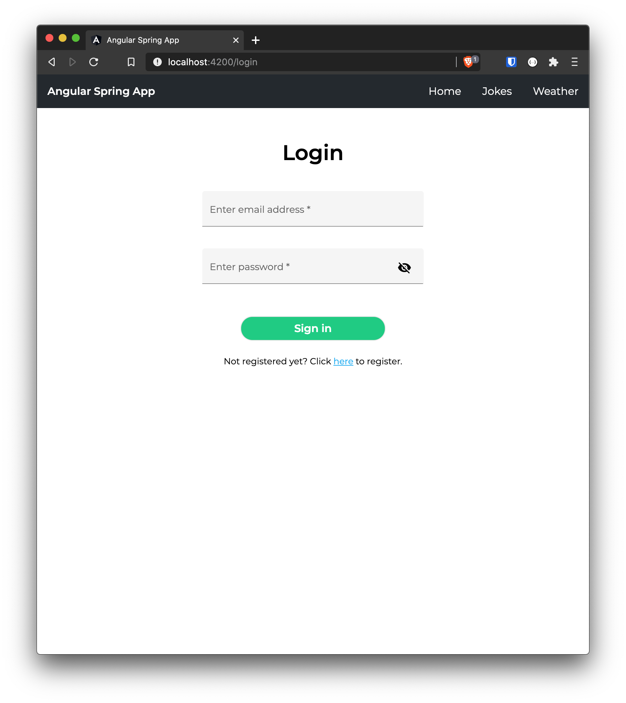
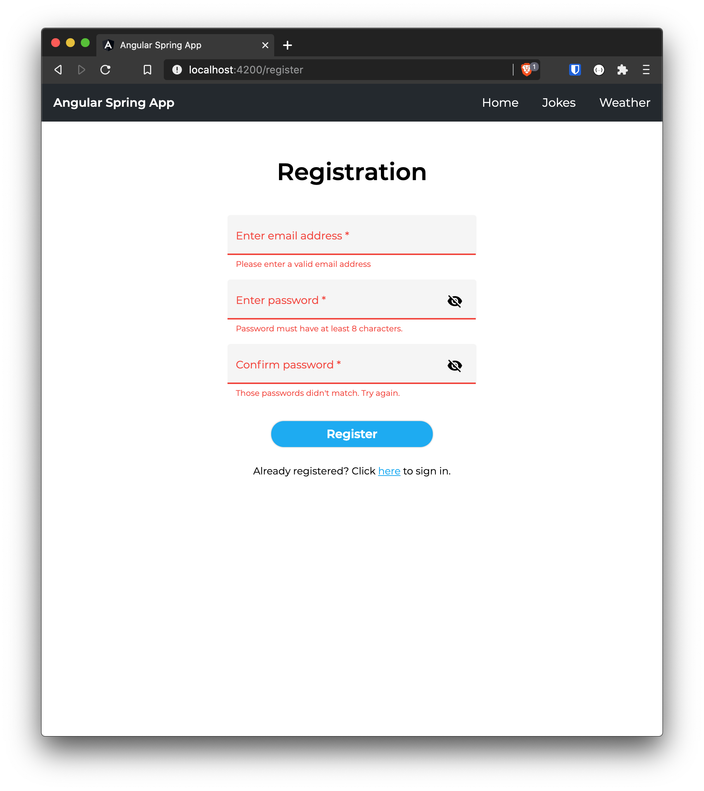
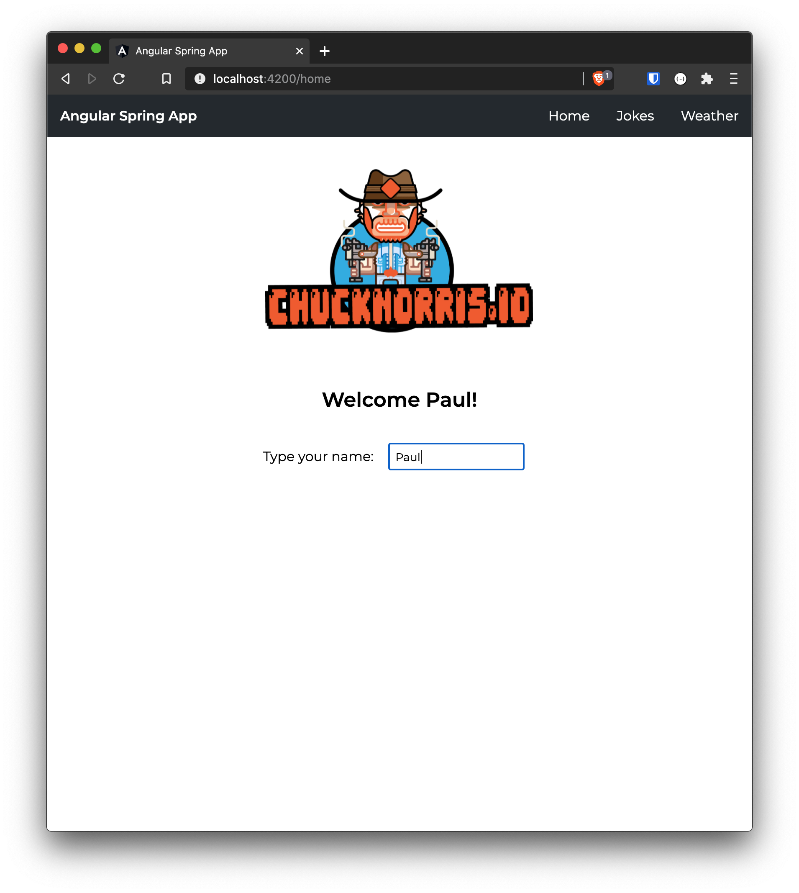
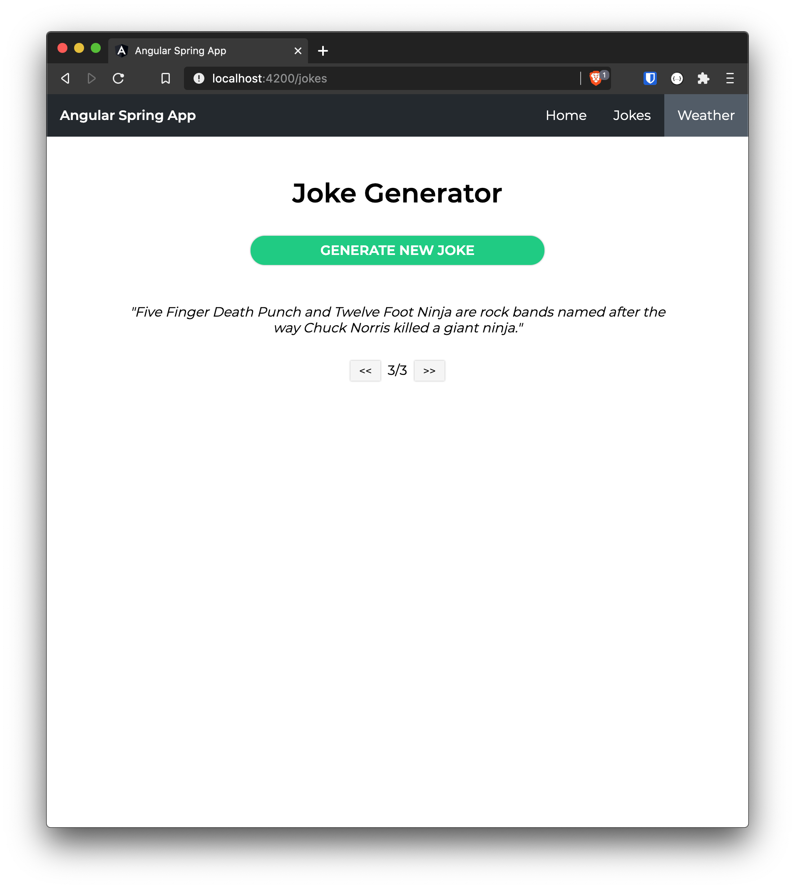
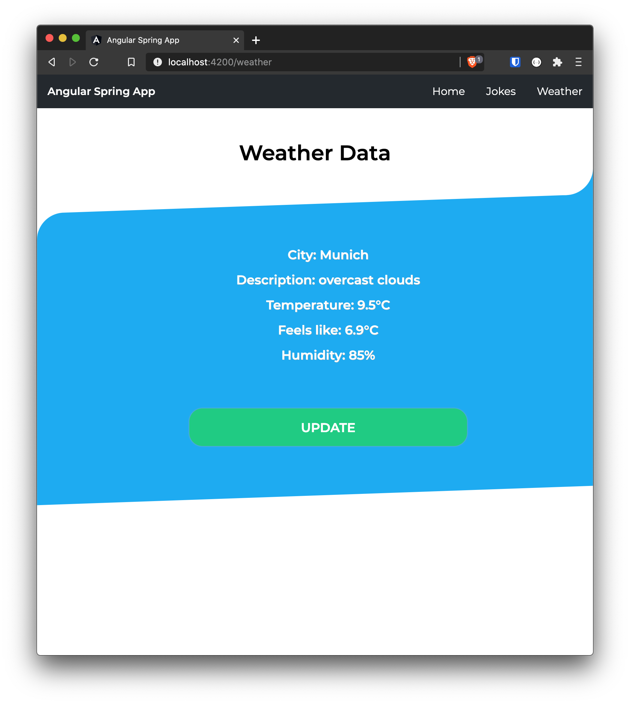
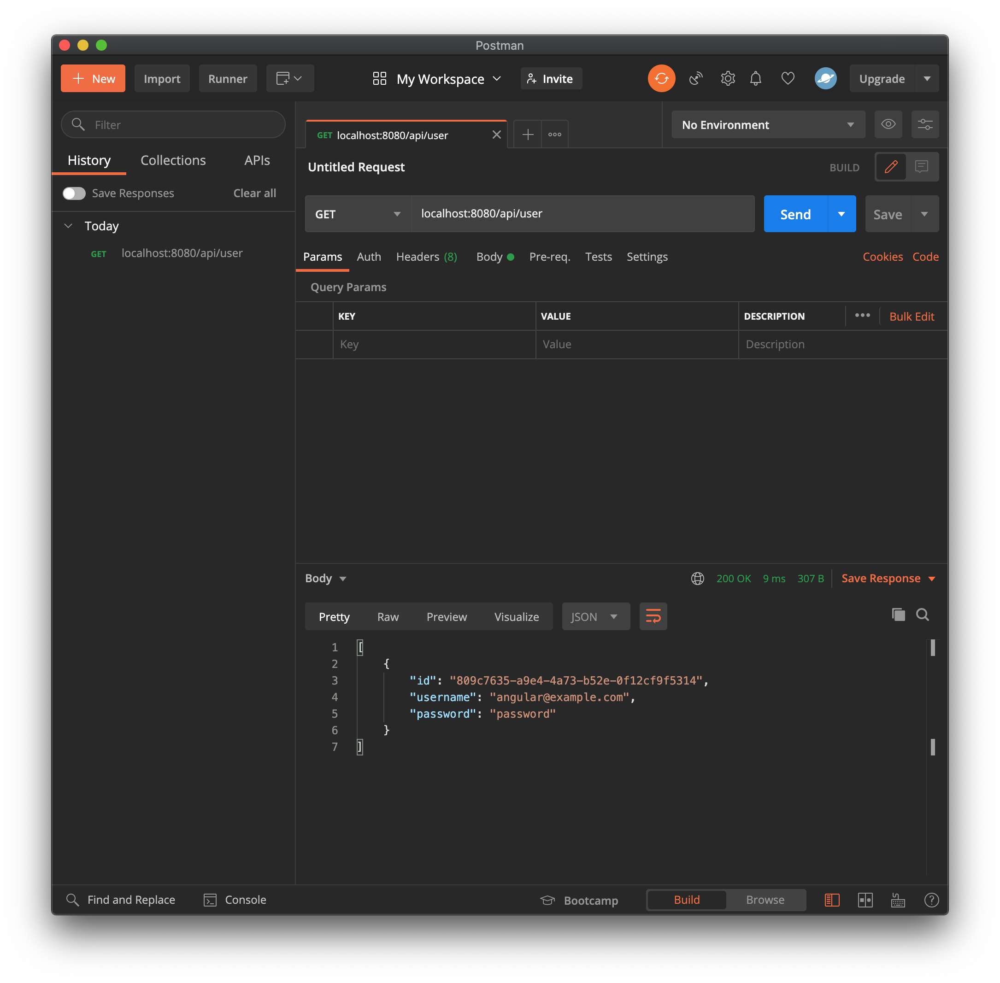

# Angular Spring App

This project was generated with [Angular CLI](https://github.com/angular/angular-cli) version 10.1.4 and [Spring Boot](https://spring.io/) version 2.3.4.

#### Demo

## Components

#### Login and Registration

Before using the app, the user has to register. A UUID is created and added to a JSON file which is then sent to the Spring backend by the authentication service via HTTP POST.

The registration as well as the login component use validators to sanitize the inputs. 
They ensure valid formats for both the email address as well as the password.
Furthermore, the equalValueValidator function in the registration component ensures that password and confirmPassword match.
**Angular Material** modules provide a clear input mask.

Once the registration is complete, the user is redirected to the login mask.
When the user enters the login data and clicks the sign in button, the authentication service sends another HTTP POST to the Spring backend which then returns an AuthStatus object. 

Login                                    |  Registration                                         | Validators
:---------------------------------------:|:-----------------------------------------------------:|:----------------------------------------------------------:
  |   | 

#### Home, Jokes and Weather

The home component displays a simple user input and makes use of basic Angular directives like ngClass and ngIf.
When the user enters a string into the mask, ngClass selects the *@keyframes move* CSS property to let the Chuck Norris image swing up and down.

The jokes component generates Chuck Norris jokes from the [Chuck Norris API](https://api.chucknorris.io/).
Once the user clicks the **GENERATE JOKE** button, the joke service sends a HTTP GET to the API.
The received joke is saved in an array placed in the joke service to conserve it even if the user switches between pages. 

The weather component as well as the weather service are placed into a separate module to enable **lazy-loading**.
It fetches current weather data of Munich from the [Open Weather API](https://openweathermap.org/api).
A HTTP interceptor adds an app id to the URL. Pipes present the data in the right format.

Home                                    |  Jokes                                   | Weather
:--------------------------------------:|:----------------------------------------:|:------------------------------------------:
  |   | 

## Spring Backend

The Spring backend consists of three layers: an API/controller layer, a service layer, and a data access layer.
Once a user registers, the data is saved in an array list mocking a database. 
[Postman](https://www.postman.com/) can be used to interact with the server, e.g. to get a list of registered users.

## Run the App

Run `ng serve` in the angular-spring-app CLI to start the angular frontend. Navigate to `http://localhost:4200/`. The app will automatically reload if you change any of the source files.

Run DemoApplication.java in the spring-app project to start the backend.
