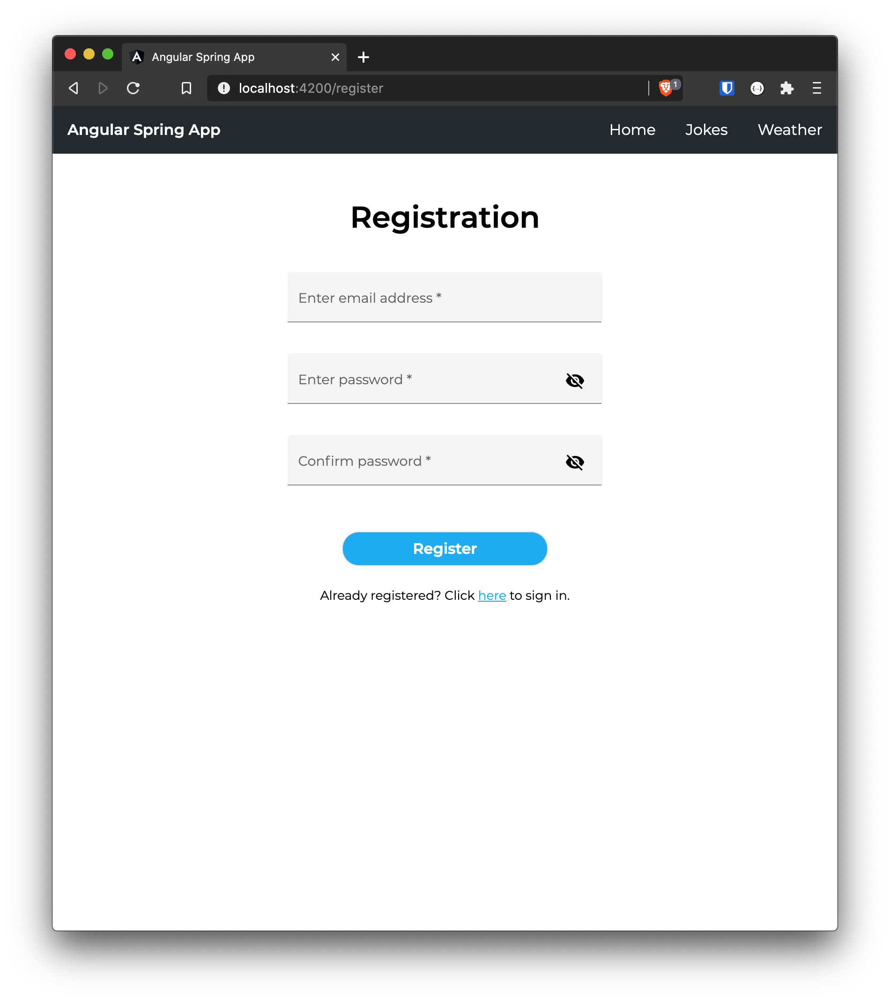

# Angular Spring App

This project was generated with [Angular CLI](https://github.com/angular/angular-cli) version 10.1.4 and [Spring Boot](https://spring.io/) version 2.3.4.

## Run the App

Run `ng serve` in the angular-spring-app CLI to start the angular frontend. Navigate to `http://localhost:4200/`. The app will automatically reload if you change any of the source files.

Run DemoApplication.java in the spring-app project to start the backend. You can use [Postman](https://www.postman.com/) to interact with the server via port 8080.

## Demo

## Components

### 1. Login and Registration

The login is the default page. An AuthGuard locks all other pages until the user has logged in. Prior to the initial login the user has to register.

Login                      |  Registration
:-------------------------:|:-------------------------:
  |  

Validators are used to perform sanity checks and ensure the right format for both the username and the password.

Validators                 |
:-------------------------:|
  |

